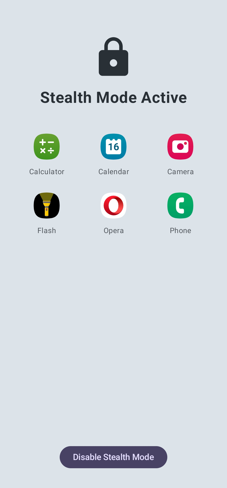

# Deep Freezer


A powerful Android utility that allows you to "freeze" (disable) applications on your device. This is ideal for boosting performance, maximizing battery life, or simply putting distracting apps on a temporary timeout. Built entirely with Jetpack Compose, it offers a modern and intuitive user experience.

The app's core functionality relies on becoming a **Device Owner**, which grants it the necessary permissions to manage other applications without requiring root access.

## ✨ Features

* **Freeze & Unfreeze Apps**: Seamlessly disable and enable any user-installed or system application with a simple toggle.
* **Intuitive UI**: A clean, modern interface built with the latest Jetpack Compose toolkit for smooth and responsive interaction.
* **Organized App Lists**: Browse your applications in categorized tabs: "All Apps," "Social Media," and "Frozen Apps" for easy management.
* **Quick Search**: Instantly find any application using the built-in search bar.
* **Stealth Mode**: A unique focus mode that freezes every app on your device except for a customizable whitelist of essential apps.
* **App Lock**: Enhance your privacy by securing the Deep Freezer app itself with your device's biometric authentication or screen lock.
* **Device Owner Power**: Leverages Device Administrator permissions to gain full control over app management without requiring root access.

## 📸 Screenshots

| Home Screen                               | Frozen Apps                               | Settings                                |
| ----------------------------------------- | ----------------------------------------- | --------------------------------------- |
|  |  |  |

| Stealth Mode                              | Stealth Mode App Selection                |
| ----------------------------------------- | ----------------------------------------- |
|  |  |

## 🛠️ Technologies Used

* **Kotlin**: The primary programming language.
* **Jetpack Compose**: For building the entire user interface declaratively.
* **Device Administrator API**: To enable Device Owner permissions for app management.

## 🚀 Getting Started

For Deep Freezer to work, it must be set as the **Device Owner** on your phone. This is a one-time setup process that requires a computer with ADB (Android Debug Bridge).

### Prerequisites

* An Android device.
* A computer with **ADB** (Android Debug Bridge) installed. You can get it by installing [Android SDK Platform Tools](https://developer.android.com/studio/releases/platform-tools).

### Installation & Activation

1.  **Download the App**
    * Go to the **Releases** section of this repository.
    * Download the latest `.apk` file.

2.  **Prepare Your Phone**
    * **Enable Developer Options**: Go to `Settings > About phone`, then tap `Build number` seven times.
    * **Enable USB Debugging**: Go to `Settings > Developer options` and toggle on `USB debugging`.

3.  **Prepare Your Computer**
    * Connect your phone to your computer via USB.
    * A prompt should appear on your phone asking to "Allow USB debugging." Check "Always allow from this computer" and tap "Allow."

4.  **Remove Accounts & Disable Conflicting Apps**
    * **Remove ALL Accounts**: Go to `Settings > Accounts` and remove every account (Google, Samsung, etc.). This is temporary and you can re-add them later.
    * **Disable conflicting apps** (like WhatsApp) using ADB:
        ```sh
        # Disable WhatsApp
        adb shell pm disable-user --user 0 com.whatsapp

        # Disable WhatsApp Business
        adb shell pm disable-user --user 0 com.whatsapp.w4b
        ```

5.  **Install and Set as Device Owner**
    * **Install the APK** via ADB:
        ```sh
        adb install path/to/your-downloaded-app.apk
        ```
    * **Set as Device Owner** (run this command precisely):
        ```sh
        adb shell dpm set-device-owner com.asadbyte.deepfreezer/.ui.freeze.DeviceAdminReceiver
        ```
        You should see a "Success" message.

6.  **Final Steps**
    * You can now disconnect your phone.
    * Re-add your Google and other accounts in your phone's settings.
    * Re-enable any apps you disabled:
        ```sh
        # Re-enable WhatsApp
        adb shell pm enable com.whatsapp
        ```

## 🤝 Contributing

Contributions are what make the open-source community such an amazing place to learn, inspire, and create. Any contributions you make are **greatly appreciated**.

If you have a suggestion that would make this better, please fork the repo and create a pull request. You can also simply open an issue with the tag "enhancement".

1.  Fork the Project
2.  Create your Feature Branch (`git checkout -b feature/AmazingFeature`)
3.  Commit your Changes (`git commit -m 'Add some AmazingFeature'`)
4.  Push to the Branch (`git push origin feature/AmazingFeature`)
5.  Open a Pull Request

## 📄 License

Distributed under the Apache 2.0 License. See `LICENSE` for more information.

---

<p align="center">
  Made with ❤️ by asadbytes
</p>
